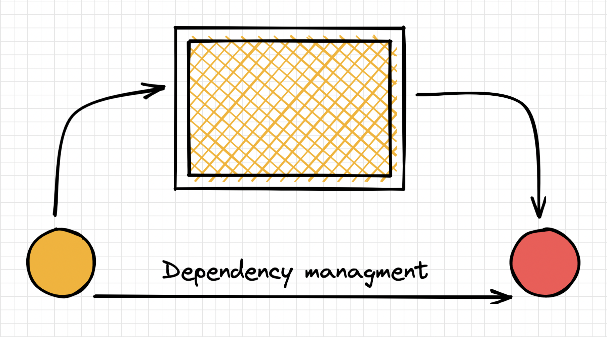

# React Hooks 

This is the chapter that is the main chapter.

## `useState` hook tests

This is the hook for functional components to save local state. This state is the best state and then the things are not here. When the things are not done and then they seem to happen. 

``` javascript
const a = 0;
const b = 20;

const c = a + b; 
console.log(c);

function help(object) {
  console.log(object)
}
```

## useEffect hook

This is a different hook than use state hook which is used to make side effects come up. The side effect is caused when the component is mounted and unmounted. 

> **note**: This is a blockquote and this is the only blockquote

That is so funny! :joy:

I need to highlight these ==very important words==.

This is a superscript: H~2~O

This is the subscript: X^2^

~~The world is flat.~~

---

## List of taskss

- [x] Write the press release
- [ ] Update the website
- [ ] Contact the media

## Term and definition

term
: definition

## Inline code

This is come inline `code` that is the best thing which is some code. 

## Testing custom containers

::: warning
javascript
:::

::: tag
tag
:::

`test`

## Image

This is the text above the image and it is as important as below. 


::: caption
⚠️ *this is an image caption*
:::

This is an image. And this is the thing below the image.